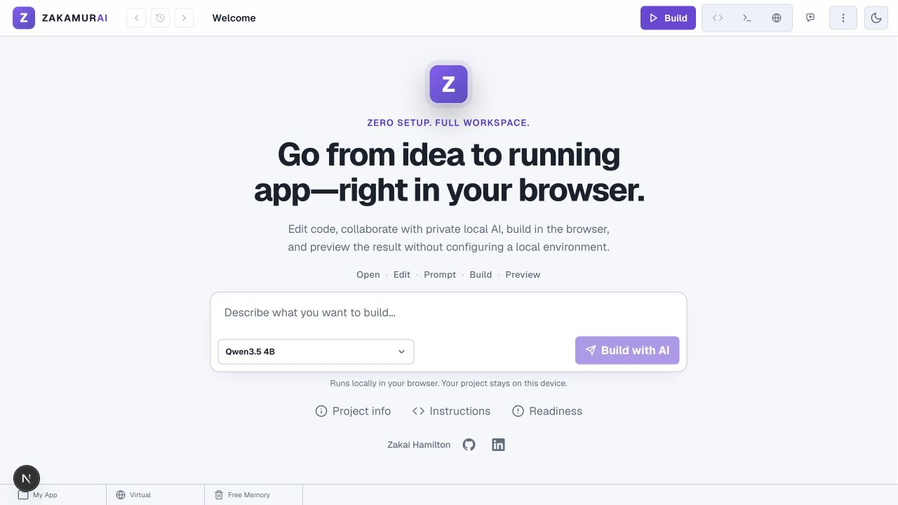

# Zakamurai

<div align="center">

### Your AI coding workspace in the browser

Edit projects, ask for help, build in the browser, and see the result in a live preview—without a local toolchain.

[](https://github.com/zakaihamilton/zakamurai/actions/workflows/component-tests.yml)

[Try Zakamurai](https://www.zakamurai.com) · [Run locally](#run-locally)

</div>



Zakamurai is a browser-based IDE for building and iterating on web projects. It combines a focused code workspace with browser-local AI assistance, in-browser builds, runtime logs, and live preview in one place.

## Why Zakamurai?

- **A complete browser workspace** — Explore files, edit code, format documents, navigate between CSS and JavaScript references, and switch between code, logs, and preview.
- **AI that works beside you** — Ask questions or request changes with project context. Review structured side-by-side diffs. Proposed buffers are already what Build and Preview compile; approving confirms them and unblocks disk flush.
- **Build without leaving the browser** — Compile supported projects with browser-based runtime and bundling tools, then inspect build output and runtime logs.
- **A focused idea-to-preview loop** — Move from a change to a working result without setting up a separate editor, build process, and preview server.
- **Built around browser storage** — Projects persist locally in IndexedDB, with a localStorage fallback when IndexedDB is unavailable. Export a project as a ZIP whenever you need a portable copy.

## From idea to preview

1. **Edit** your project in the file explorer and editor.
2. **Prompt** the local AI assistant for an explanation, suggestion, or code change.
3. **Review** the generated diff. Build and Preview already compile the proposed buffers; approve to confirm them (and to allow LocalFS auto-save) or undo to restore.
4. **Build** with `Cmd+Enter` on macOS or the **Build** button.
5. **Preview** the result and inspect logs when something needs attention.

## Browser capabilities

Zakamurai keeps the core workflow in the browser:

- **Local AI** uses WebLLM and WebGPU when the browser and device support them. Web Workers are also required for local AI inference.
- **Editing and builds** remain available without local AI, so a device without WebGPU can still be used for browser-based projects.
- **Project data** is stored in the browser. The File System Access API is optional and only available in compatible browsers.
- **Preview isolation** uses a separate origin in configured production deployments, keeping preview code away from the IDE’s storage, cookies, and parent DOM.

## Run locally

### Prerequisites

- [Node.js](https://nodejs.org/) 24 (the supported range is `>=24 <26`; Node.js 25 is compatibility-tested in CI)
- npm 10 or newer

### Start the development server

```bash
git clone https://github.com/zakaihamilton/zakamurai.git
cd zakamurai
npm install
npm run dev
```

Open [http://localhost:3000](http://localhost:3000). Isolated preview runs at [http://localhost:3001](http://localhost:3001).

Same-origin preview (weaker isolation, IDE and preview share storage) is available with `npm run dev:same-origin` when you are not using the two-port workflow.

The `postinstall`, `predev`, and `prebuild` scripts prepare the browser runtime assets used by the in-browser compiler, preview, and AI features.

### Isolated preview development

`npm run dev` already starts the two-origin local workflow. The IDE runs at `http://localhost:3000` and the preview runtime at `http://localhost:3001`. `npm run dev:isolated` is an alias for the same command.

### Production build

```bash
npm run build
npm start
```

## Storage and recovery

Zakamurai saves projects locally in IndexedDB and falls back to browser localStorage when needed. If both stores reject a write—for example, because browser quota is exhausted—the current workspace remains available in memory and the app offers an immediate ZIP export. Export before closing the tab in that situation.

## Production preview isolation

For isolated preview execution on Vercel, configure both origins and attach them to the same Vercel project:

```bash
NEXT_PUBLIC_IDE_ORIGIN=https://www.zakamurai.com
NEXT_PUBLIC_PREVIEW_ORIGIN=https://preview.zakamurai.com
```

Add `preview.zakamurai.com` in **Project Settings → Domains** and create the CNAME record Vercel provides. The preview subdomain must not redirect to `www`.

If these variables are omitted on a `*.vercel.app` deployment, Zakamurai uses a same-origin `/__preview/` compatibility surface so the app remains usable without additional deployment configuration. This fallback has weaker isolation; configure both origins for production deployments.

## Development

The main quality gate mirrors CI and checks formatting, linting, architecture, types, tests, builds, performance budgets, preview security, visual regressions, and dependency advisories:

```bash
npm run verify
```

Useful focused commands:

| Command | Purpose |
| --- | --- |
| `npm run test` | Run the unit test suite |
| `npm run test:coverage` | Run unit tests with coverage thresholds |
| `npm run test:e2e` | Run Chromium smoke tests |
| `npm run test:visual` | Run Chromium/WebKit visual regression and accessibility tests |
| `npm run test:visual:update` | Regenerate visual baselines for the current platform |
| `npm run test:visual:chromium` | Run Chromium visual regression tests |
| `npm run test:visual:webkit` | Run WebKit visual regression tests |
| `npm run test:promptfoo` | Run static AI compliance checks without API keys |
| `npm run check:architecture` | Enforce project architecture rules |
| `npm run check:runtime-assets` | Verify generated browser runtime assets |
| `npm run verify:ai` | Run optional extended AI regression checks |

Visual snapshots are platform-specific. Run `npm run test:visual:update` on the target CI platform to regenerate its baselines, then run `npm run test:visual` without the update flag to verify them.

For AI reliability and browser memory profiling, see the [AI memory profiling workflow](./docs/ai-memory-profiling.md). The static AI checks use the local echo provider and golden fixtures in [`tests/ai-golden/`](./tests/ai-golden/); they do not require API keys.

## Architecture and contributing

Before changing the application, read:

- [Architecture and state-management rules](./ARCHITECTURE.md)
- [Contributor guide](./CONTRIBUTING.md)
- [AI assistant instructions](./AGENTS.md)
- [Security policy](./SECURITY.md)

The project is MIT-licensed. It uses the `triactor` hierarchical proxy-state package, CSS Modules, and browser-first persistence. Shared state should use `triactor` rather than Redux, Zustand, Recoil, or a second global store. Install with **npm** (`package-lock.json`); do not add a Yarn lockfile.

```text
src/
├── app/              # Next.js app router and preview routes
├── components/
│   ├── AI/           # WebLLM integration, prompts, diffs, and agent flow
│   ├── App/          # IDE shell, editor, sidebar, preview, and top bar
│   ├── Storage/      # Settings, LocalFS, and project persistence
│   └── ui/           # Shared UI components
├── constants/        # Shared application constants
└── utils/            # Compiler, navigation, formatting, and RAG helpers
```

## Tech stack

| Layer | Technologies |
| --- | --- |
| Application | [Next.js](https://nextjs.org/) 16, [React](https://react.dev/) 19, TypeScript |
| Styling | CSS Modules |
| Browser build | [almostnode](https://www.npmjs.com/package/almostnode), [esbuild-wasm](https://www.npmjs.com/package/esbuild-wasm) |
| Local AI | [WebLLM](https://webllm.mlc.ai/), WebGPU, WebAssembly |
| Testing | [Vitest](https://vitest.dev/), [Playwright](https://playwright.dev/), Biome, Stylelint |

## License

[MIT](./LICENSE) © Zakai Hamilton

## Author

**Zakai Hamilton**

- GitHub: [@zakaihamilton](https://github.com/zakaihamilton)
- LinkedIn: [zakai-hamilton](https://www.linkedin.com/in/zakai-hamilton)
